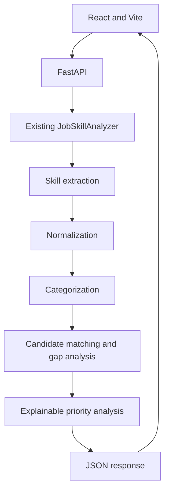

# Job Skill Analyzer

Job Skill Analyzer is a deterministic, rule-based NLP and information-extraction application that turns job descriptions into structured technical skills, candidate gaps, coverage, and explainable priorities.

---

## Overview

Modern technical job descriptions are packed with diverse, evolving requirements—from programming languages and cloud platforms to container orchestrators and development utilities. Candidates and recruiters frequently struggle to parse dense job descriptions accurately and objectively evaluate alignment.

The Python engine recognizes known technologies with boundary-aware matching, normalizes aliases, categorizes skills, and compares an optional candidate profile. FastAPI exposes that existing engine to a React and TypeScript frontend. Analysis is rule-based; the application does not use machine learning or an LLM.

## Architecture



## Tech Stack

- **Backend:** Python, FastAPI, Pydantic, Uvicorn
- **Frontend:** React, TypeScript, Vite, Tailwind CSS
- **Testing:** pytest, FastAPI TestClient, Oxlint
- **Deployment:** Multi-stage Dockerfile and Render Blueprint

---

## Visual Architecture & Interface

The application strictly implements the **Career Intelligence Design System** palette:

| Token Name | Hex Code | Semantic Role |
|---|---|---|
| `--color-deep-navy` | `#14252C` | Page canvas, primary dark background |
| `--color-dark-slate` | `#273C41` | Major panels, card surfaces, inputs |
| `--color-slate` | `#45575B` | Structural borders, dividers, subtle accents |
| `--color-muted-gray` | `#A3A39B` | Body copy, secondary metadata, explanations |
| `--color-warm-cream` | `#E6CAB3` | High-contrast headings, text highlights |
| `--color-burnt-orange` | `#82401D` | High-priority indicators, primary CTA |

The interface uses the existing local asset `frontend/public/hero-bg.jpg`; it is not downloaded at runtime. Its original source and license are not recorded in the repository, so its provenance remains unverified.

---

## Core Capabilities

- **Punctuation-Safe NLP**: Accurately recognizes tokens with non-word characters (`C++`, `C#`, `.NET`, `CI/CD`, `Node.js`) without tokenization corruption.
- **Multi-Word Phrase Recognition**: Extracts multi-token concepts (`Machine Learning`, `Natural Language Processing`, `REST API`, `GitHub Actions`, `Google Cloud`) using longest-match precedence.
- **False-Positive Prevention**: Negative lookbehind and lookahead assertions prevent spurious substring matches ("Go" in "Chicago", "C" in "Cat", "Java" in "JavaScript").
- **Canonical Normalization**: Standardizes synonyms, abbreviations, and informal aliases (`postgres` &rarr; `PostgreSQL`, `k8s` &rarr; `Kubernetes`, `js` &rarr; `JavaScript`).
- **Structured Categorization**: Categorizes all recognized skills into eight deterministic engineering taxonomy domains.
- **Objective Candidate Gap Analysis**: Compares job requirements against candidate profiles only when candidate skills are supplied, calculating match percentages and identifying missing proficiencies.
- **Explainable Priority Analysis**: Ranks required skills (High, Medium, Low) using transparent, documented rules based on posting frequency and core architectural tiers.
- **Full-Featured Web Platform**: Interactive React/TypeScript dashboard with category, priority, status, and text filtering, summary copying, JSON export, and HTML report downloads.
- **Multiple Interfaces**: CLI, typed FastAPI REST API, and modern Web UI.

---

## Architecture Pipeline

```
JOB DESCRIPTION
       ↓
Text Preprocessing (Whitespace, Unicode & Typographic Normalization)
       ↓
Skill Extraction (Boundary-Aware Regex & Greedy Non-Overlapping Spans)
       ↓
Skill Normalization (Alias Mapping to Canonical Taxonomy)
       ↓
Skill Categorization (Deterministic Domain Grouping)
       ↓
Candidate Skill Comparison (Normalized Profile Intersection)
       ↓
Gap Analysis (Matched vs. Missing Skills & Coverage Calculation)
       ↓
Priority Analysis (Deterministic Rules & Explainable Rationale)
       ↓
Structured Report (CLI / JSON / Standalone HTML / Interactive Web App)
```

---

## Repository Structure

```
job-skill-analyzer/
├── job_skill_analyzer/        # Python NLP Engine & API
│   ├── __init__.py
│   ├── __main__.py
│   ├── analyzer.py            # Pipeline orchestrator
│   ├── api.py                 # FastAPI REST API layer
│   ├── cli.py                 # Command-line interface
│   ├── extractor.py           # Boundary-aware regex engine
│   ├── formatter.py           # Terminal & HTML report generator
│   ├── models.py              # Strongly-typed dataclasses & enums
│   ├── normalizer.py          # Preprocessing & alias translation
│   └── taxonomy.py            # Canonical taxonomy & aliases
├── frontend/                  # Modern React Web Product
│   ├── src/
│   │   ├── components/        # Navbar, Hero, Workspace, Dashboard, Footer
│   │   ├── services/          # Typed API client
│   │   ├── types/             # TypeScript data contracts
│   │   ├── App.tsx            # Main stateful application
│   │   └── index.css          # Tailwind CSS styles & palette tokens
│   ├── public/                # Local assets (hero-bg.jpg)
│   ├── tailwind.config.js     # Design system configuration
│   └── vite.config.ts
├── tests/                     # Python unit, edge-case, and API tests
│   ├── test_api.py            # FastAPI endpoint tests
│   ├── test_categorization.py # Taxonomy category tests
│   ├── test_cli.py            # CLI argument and output tests
│   ├── test_edge_cases.py     # Punctuation, empty input, stress tests
│   ├── test_extraction.py     # Boundary token extraction tests
│   ├── test_gap_analysis.py   # Candidate matching tests
│   ├── test_normalization.py  # Alias mapping tests
│   ├── test_priority.py      # Explainable priority rules tests
│   └── browser_verification.py # Automated Playwright desktop/mobile tests
├── examples/
│   ├── sample_job_description.txt
│   └── sample_candidate_skills.txt
├── .github/workflows/ci.yml   # Python tests and frontend production build
├── Dockerfile                 # Multi-stage single-service build
├── .dockerignore
├── .gitignore
├── LICENSE
├── pyproject.toml
├── render.yaml                # Render deployment blueprint
├── requirements.txt
└── requirements-dev.txt
```

---

## Getting Started

### Prerequisites
- Python 3.11+
- Node.js 18+ (for frontend development)

### 1. Python Environment Setup

```bash
# Create and activate virtual environment
python -m venv .venv

# Windows:
.venv\Scripts\activate
# Linux/macOS:
source .venv/bin/activate

# Install dependencies
pip install -r requirements.txt
pip install -r requirements-dev.txt
```

### 2. Build and Run the Web Application

Build the frontend bundle first; FastAPI serves it from the same origin as the API:

```bash
cd frontend
npm ci
npm run build
cd ..
python -m uvicorn job_skill_analyzer.api:app --host 0.0.0.0 --port 8000
```
Open **[http://127.0.0.1:8000](http://127.0.0.1:8000)** in your browser. During frontend development, run the backend on port `8000` and use `npm run dev` from `frontend`; Vite proxies `/api` requests to FastAPI.

### 3. Frontend Development (Hot-Reload)

To run the Vite dev server separately:

```bash
cd frontend
npm install
npm run dev
```

### 4. CLI Usage

The analyzer can also be run as a standalone terminal tool:

```bash
# Analyze a job description file
python -m job_skill_analyzer --file examples/sample_job_description.txt

# Compare against candidate competencies
python -m job_skill_analyzer --file examples/sample_job_description.txt --candidate "Python, Docker, React, PostgreSQL"

# Output structured JSON
python -m job_skill_analyzer --file examples/sample_job_description.txt --json

# Generate standalone HTML report
python -m job_skill_analyzer --file examples/sample_job_description.txt --html report.html
```

---

## REST API Specification

| Method | Endpoint | Description | Payload |
|---|---|---|---|
| `GET` | `/api/health` | Service health status | None |
| `GET` | `/api/sample` | Pre-configured realistic sample data | None |
| `POST` | `/api/analyze` | Execute complete NLP analysis | `{"job_description": "...", "candidate_skills": "..."}` |
| `POST` | `/api/report/html` | Generate downloadable HTML report | `{"job_description": "...", "candidate_skills": "..."}` |

---

## Priority Analysis Methodology

The priority engine is 100% deterministic and explainable:

1. **High Priority**:
   - Any skill mentioned $\ge 2$ times within the job description (indicating repeated emphasis).
   - Missing skills in foundational infrastructure pillars: Cloud, Programming Languages, or Databases.
2. **Medium Priority**:
   - Standard technical requirements in Frameworks, DevOps, API & Backend, or AI & Data Science mentioned once.
3. **Low Priority**:
   - Auxiliary tooling and operational utilities (e.g., Git, GitHub, Linux) mentioned once.

Every priority ranking is accompanied by a plain-language `reason` string explaining why it was categorized.

---

## Automated Testing Suite

Run the complete test suite:

```bash
# Run unit, edge-case, and API tests
python -m pytest -v

# Run full browser interaction tests (desktop & mobile via Playwright)
python tests/browser_verification.py
```

---

## Deployment

The repository includes a multi-stage `Dockerfile`, a `.dockerignore`, and a Render Blueprint in `render.yaml`. The frontend build stage produces `frontend/dist`; the runtime stage copies that directory beside the Python package, where FastAPI mounts it at `/`. Render runs this as a single web service with `/api/health` as its health check. The container listens on Render's `PORT` and does not require application secrets or a database.

Docker is unavailable in the current environment, so the image build and container startup have not been executed locally. The deploy configuration has not been exercised against a live Render account from this workspace.

## API

- `GET /api/health` reports service health.
- `GET /api/sample` returns sample job and candidate inputs.
- `POST /api/analyze` returns extracted skills, categories, candidate gaps, coverage, and explainable priorities as validated JSON.
- `POST /api/report/html` returns a standalone HTML report.

Job descriptions must contain 1 to 100,000 characters. Unexpected server errors are logged server-side and returned without internal exception details.

## Limitations and Roadmap

The analyzer is deterministic and rule-based; it only recognizes skills represented in its taxonomy and does not infer semantic equivalents outside those rules. The bundled hero image's original source/license is undocumented and should be replaced or attributed after its provenance is confirmed. Potential next steps are broader taxonomy coverage and maintained image attribution.

---

## License

MIT License &bull; Copyright (c) 2026 Vikas
